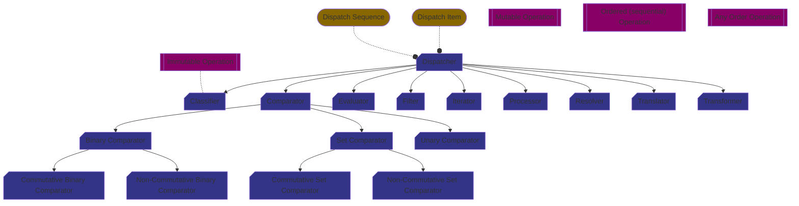

# Dispatchers

> [!NOTE]
> This document might later be rewritten in a custom format that exports to [GFM](https://github.github.com/gfm/) just to make project management via github easier.

```mermaid
flowchart TD

	%% Mermaid Styling

	classDef C fill:#338
	classDef I fill:#860
	classDef N fill:#806


	%% Class Nodes

	clsfy:::C@{ shape: card, label: "Classifier" }
	comp:::C@{ shape: card, label: "Comparator" }
	comp_bin:::C@{ shape: card, label: "Binary Comparator" }
	comp_bin_com:::C@{ shape: card, label: "Commutative Binary Comparator" }
	comp_bin_noncom:::C@{ shape: card, label: "Non-Commutative Binary Comparator" }
	comp_set:::C@{ shape: card, label: "Set Comparator" }
	comp_set_com:::C@{ shape: card, label: "Commutative Set Comparator" }
	comp_set_noncom:::C@{ shape: card, label: "Non-Commutative Set Comparator" }
	comp_unary:::C@{ shape: card, label: "Unary Comparator" }
	disp:::C@{ shape: card, label: "Dispatcher" }
	eval:::C@{ shape: card, label: "Evaluator" }
	filt:::C@{ shape: card, label: "Filter" }
	iter:::C@{ shape: card, label: "Iterator" }
	proc:::C@{ shape: card, label: "Processor" }
	resolv:::C@{ shape: card, label: "Resolver" }
	tla:::C@{ shape: card, label: "Translator" }
	tfo:::C@{ shape: card, label: "Transformer" }


	%% Interface Nodes

	if_disp_item:::I@{ shape: stadium, label: "Dispatch Item" }
	if_disp_seq:::I@{ shape: stadium, label: "Dispatch Sequence" }


	%% Notation Nodes
	note_no_mutation:::N@{ shape: subproc, label: "Immutable Operation" }
	note_mutation:::N@{ shape: subproc, label: "Mutable Operation" }
	note_ordered:::N@{ shape: subproc, label: "Ordered (sequential) Operation" }
	note_any_order:::N@{ shape: subproc, label: "Any Order Operation" }


	%% Inheritance Edges

	disp --> comp
	disp --> tla
	disp --> tfo
	disp --> resolv
	disp --> filt
	disp --> eval
	disp --> clsfy
	disp --> proc
	disp --> iter

	comp --> comp_unary
	comp --> comp_bin
	comp --> comp_set

	comp_bin --> comp_bin_com
	comp_bin --> comp_bin_noncom

	comp_set --> comp_set_com
	comp_set --> comp_set_noncom


	%% Interface Edges

	if_disp_item -.-o disp
	if_disp_seq -.-o disp


	%% Note Edges


	note_no_mutation -.- clsfy


```
